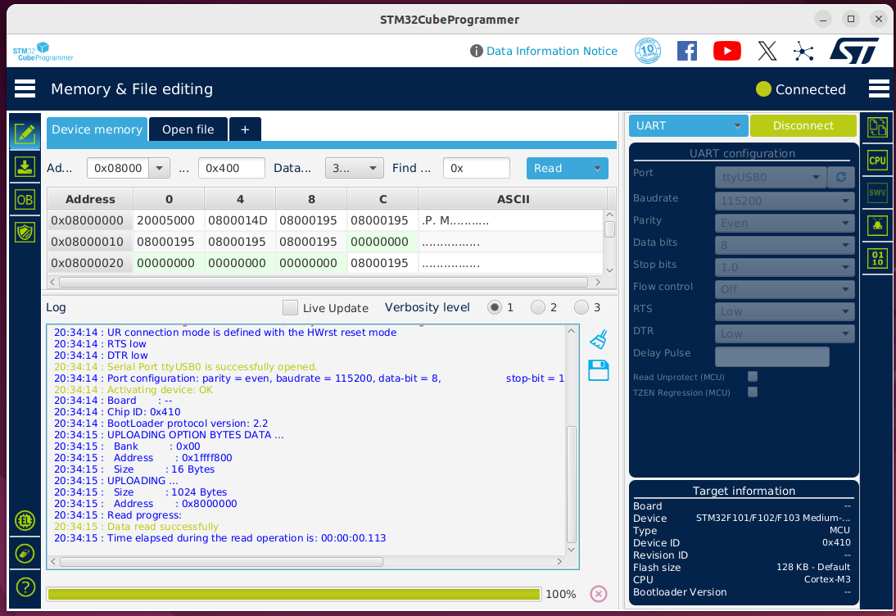
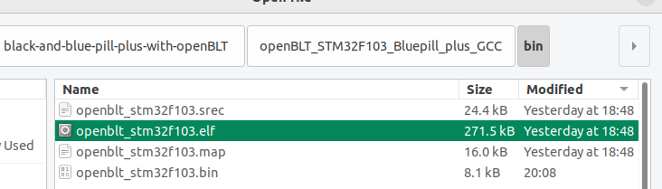
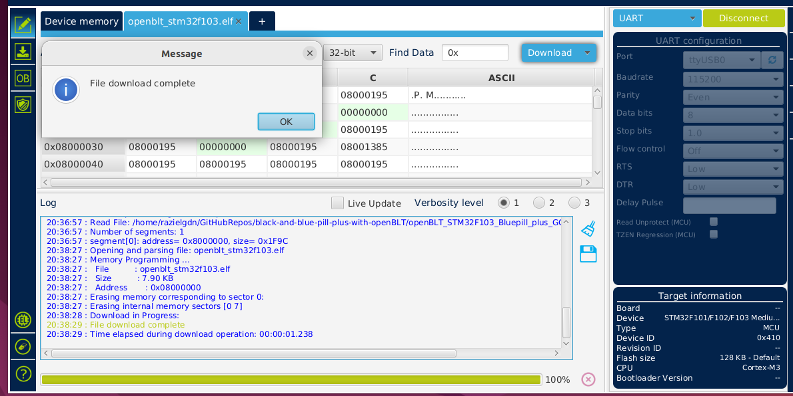

# OpenBLT running on Bluepill Plus and Blackpill boards.
This project enables the use of the **OpenBLT** **bootloader** on **Bluepill** **Plus** and Blackpill development boards, providing a lightweight and flexible solution for firmware updates on STM32-based systems.    

## Introduction
At this moment, the bootloader is ready to be used with RS232 and CAN buses.
I’m developing this project because I want to use the CAN protocol to flash a network of microcontrollers for future applications — such as an aquaponic system designed to raise fish, crustaceans, and plants. These microcontrollers will be used to control irrigation, lighting, and humidity, enabling automated and efficient system management.

## Compile the bootloader
Follow next steps to compile the bootloader maybe you will need install some prerequire packages.    
1. Clone the repo. 
   - Using https:    
   ```bash  
   git clone https://github.com/razielgdn/black-and-blue-pill-plus-with-openBLT.git -b main
   ```      
   - Using ssh:    
   ```bash   
   git clone  -b main git@github.com:razielgdn/black-and-blue-pill-plus-with-openBLT.git
   ```   
2. Navigate to the bootloader directory *OpenBLT_STM32F103_Bluepill_plus_GCC*:    
   ```bash  
   cd black-and-blue-pill-plus-with-openBLT/openBLT_STM32F103_Bluepill_plus_GCC
   ``` 
3. Make sure the path to your ARM GCC toolchain(e.g. `arm-none-eabi-gcc`) is correctly set in the **makefile**.   
After updating the path, compile the bootloader with:         
   ```bash 
   make clean all
   ``` 
4. If everything compiles successfully, the output files will be located in the **bin/** directory. You can use any of the generated binaries as needed.
   ```
   openblt_stm32f103.elf
   openblt_stm32f103.map
   openblt_stm32f103.srec
   ```

## Flashing the bootloader
To enter boot mode on a **Blue Pill Plus (STM32F103C8T6)**, follow these steps:
   1. Hold down the **BOOT0** button.
   2. While holding **BOOT0**, press and release the **NRST** (reset) button.
   3. Then release the **BOOT0** button.

You can flash the bootloader using any tool available to you. Below are two  methods:
   - [**stm32flash**](https://sourceforge.net/p/stm32flash/wiki/Home/). An open-source cross-platform flash tool for STM32 ARM microcontrollers, using the built-in ST serial bootloader over UART or I²C.     
     - **To generate the binary file (openblt_stm32f103.bin) run:**   
       ```bash
       cd openBLT_STM32F103_Bluepill_plus_GCC/     
       ```     
       ```bash  
       make bin/openblt_stm32f103.bin 
       ```
     - **To flash the bootloader using ```stm32flash```, run the following command:**    
       ```bash 
       stm32flash -b 115200 -w bin/openblt_stm32f103.bin -g 0x0 /dev/ttyUSB0
       ```       
  
   - [STM32CubeProgrammer](https://www.st.com/en/development-tools/stm32cubeprog.html) (STM32CubeProg) is an all-in-one multi-OS software tool for programming STM32 products. You can use UART, STLINK or J-link.    
   The programmer supports multiple output formats, including **srec**, **bin**, and **elf**.   
      - Open STMCubeProgrammer and connect with the microcontroller in STM boot mode      
          
      - Load the desired output file, for example: ```bin/openblt_stm32f103.bin```    
          
      - Click the Download button to flash the binary onto the microcontroller.  
          
   Once completed, **OpenBLT** is now running on the **Bluepill Plus** board.    
## Adapting an application to use with openBLT.
Your embedded application must meet certain integration requirements. The bootloader expects the user application to be located at a specific memory address and to include a valid checksum for verification. 
1. Update the Linker Script
2. Configure Vector Offset
3. 
## Using OpenBLT  
Once the bootloader has been successfully flashed onto the microcontroller, you can begin using OpenBLT to perform firmware updates over supported communication interfaces such as UART, and CAN, <!-- USB, or TCP/IP,--> depending on your configuration.
Feaser provides several tools to interface with the bootloader and flash application binaries:   
- [BootCommander](https://www.feaser.com/openblt/doku.php?id=manual:bootcommander)  – a command-line utility.
- **MicroBoot** – a GUI-based utility.
- **OpenBLT Library** – for integrating firmware updates into custom host applications 
- **OpenBLT Embedded Library (LibMicroBLT)** - The LibMicroBLT library encompasses all the functionality needed to perform a firmware update on another microcontroller, running the OpenBLT bootloader.
  
### Using BootCommander to flash to openBLT Bootloader

You can flash firmware binaries to the target platform using the BootCommander utility.
This project includes example demos to test the flashing process. Refer to the [demo documentation](doc/demos/compile-demos.md) for instructions on how to compile them.


## Resources used in this project
### Blue Pill Plus board
The documentation for the device is available in its [GitHub repository](https://github.com/WeActStudio/BluePill-Plus), and a good summary can also be found on [stm32-base.org](https://stm32-base.org/boards/STM32F103C8T6-WeAct-Blue-Pill-Plus-Clone).    

### OpenBLT Bootloader
**OpenBLT** is open source and licensed under the GNU General Public License v3 (GPLv3). It was created and is maintained by **Feaser**. You can visit their [official website](https://www.feaser.com/openblt/doku.php?id=homepage) for more information and documentation.     

### Test applications
The test applications were obtained from **John Blaiklock’s** [GitHub repository](https://github.com/miniwinwm/BluePillDemo), and the original source code was adapted for this project.    
<!-- …
Comments
 2032  stm32flash -b 115200 -w bin/openblt_stm32f103.bin /dev/ttyUSB0 
 2033  stm32flash -b 115200 -w Source-openBLT/bin/openblt_stm32f103.bin /dev/ttyUSB0 
 2034  stm32flash -b 115200 -w openBLT_STM32F103_Bluepill_plus_GCC/bin/openblt_stm32f103.bin /dev/ttyUSB0 
 2035  ./BootCommander -s=xcp -t=xcp_rs232 -d=/dev/ttyUSB0 -b=57600 ../test-applications/BluepillDemo_GPIO/bin/demoGPIO_stm32f103.srec 
 2036  BootCommander/BootCommander -s=xcp -t=xcp_rs232 -d=/dev/ttyUSB0 -b=57600 test-applications/BluepillDemo_GPIO/bin/demoGPIO_stm32f103.srec 
 2037  BootCommander/BootCommander -s=xcp -t=xcp_rs232 -d=/dev/ttyUSB0 -b=57600 test-applications/BluepillDemo_GeneralTimer/bin/demoTimer_stm32f103.srec 
 2038  history 

Note: To generate the binary file openblt_stm32f103.bin, run:

cd openBLT_STM32F103_Bluepill_plus_GCC/
make bin/openblt_stm32f103.bin 

 --> 