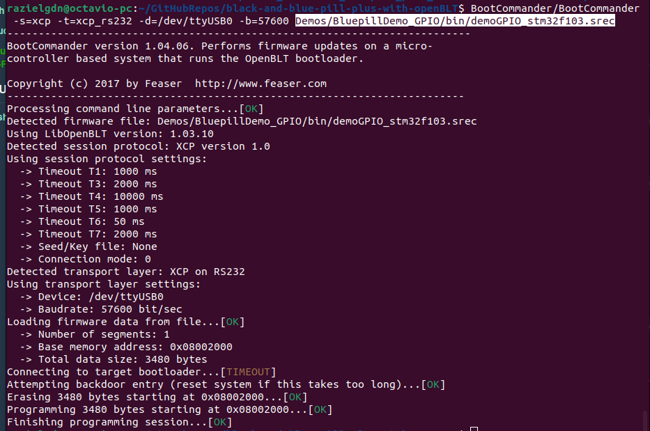

# OpenBLT running on Bluepill Plus and Blackpill boards.
This project enables the use of the **OpenBLT** **bootloader** on **Bluepill** **Plus** and Blackpill development boards, providing a lightweight and flexible solution for firmware updates on STM32-based systems.    

## Introduction
At this moment, the bootloader is ready to be used with RS232 and CAN buses.
I’m developing this project because I want to use the CAN protocol to flash a network of microcontrollers for future applications — such as an aquaponic system designed to raise fish, crustaceans, and plants. These microcontrollers will be used to control irrigation, lighting, and humidity, enabling automated and efficient system management.

## Compile the bootloader
Follow next steps to compile the bootloader maybe you will need install some prerequire packages.    
1. Clone the repo. 
   - Using https:    
   ```bash  
   git clone https://github.com/razielgdn/black-and-blue-pill-plus-with-openBLT.git -b main
   ```      
   - Using ssh:    
   ```bash   
   git clone  -b main git@github.com:razielgdn/black-and-blue-pill-plus-with-openBLT.git
   ```   
2. Navigate to the bootloader directory *OpenBLT_STM32F103_Bluepill_plus_GCC*:    
   ```bash  
   cd black-and-blue-pill-plus-with-openBLT/openBLT_STM32F103_Bluepill_plus_GCC
   ``` 
3. Make sure the path to your ARM GCC toolchain(e.g. `arm-none-eabi-gcc`) is correctly set in the **makefile**.   
After updating the path, compile the bootloader with:         
   ```bash 
   make clean all
   ``` 
4. If everything compiles successfully, the output files will be located in the **bin/** directory. You can use any of the generated binaries as needed.
   ```
   openblt_stm32f103.elf
   openblt_stm32f103.map
   openblt_stm32f103.srec
   ```

## Flashing the bootloader
To enter boot mode on a **Blue Pill Plus (STM32F103C8T6)**, follow these steps:
   1. Hold down the **BOOT0** button.
   2. While holding **BOOT0**, press and release the **NRST** (reset) button.
   3. Then release the **BOOT0** button.

You can flash the bootloader using any tool available to you. Below are two  methods:
   - [**stm32flash**](https://sourceforge.net/p/stm32flash/wiki/Home/). An open-source cross-platform flash tool for STM32 ARM microcontrollers, using the built-in ST serial bootloader over UART or I²C.     
     - **To generate the binary file (openblt_stm32f103.bin) run:**   
       ```bash
       cd openBLT_STM32F103_Bluepill_plus_GCC/     
       ```     
       ```bash  
       make bin/openblt_stm32f103.bin 
       ```
     - **To flash the bootloader using ```stm32flash```, run the following command:**    
       ```bash 
       stm32flash -b 115200 -w bin/openblt_stm32f103.bin -g 0x0 /dev/ttyUSB0
       ```       
  
   - [STM32CubeProgrammer](https://www.st.com/en/development-tools/stm32cubeprog.html) (STM32CubeProg) is an all-in-one multi-OS software tool for programming STM32 products. You can use UART, STLINK or J-link.    
   The programmer supports multiple output formats, including **srec**, **bin**, and **elf**.   
      - Open STMCubeProgrammer and connect with the microcontroller in STM boot mode      
          
      - Load the desired output file, for example: ```bin/openblt_stm32f103.bin```    
          
      - Click the Download button to flash the binary onto the microcontroller.  
          
   Once completed, **OpenBLT** is now running on the **Bluepill Plus** board.    
## Adapting an application to use with openBLT.
Your embedded application must meet certain integration requirements. The bootloader expects the user application to be located at a specific memory address.    
1. Modify your application’s linker script to relocate the vector table and code start address so they begin after the bootloader region.
For the Bluepill Plus board, this typically involves editing the linker script file: `STM32F103C8TX_FLASH.ld`.
   ```diff
   /* Entry Point */
   ENTRY(Reset_Handler)

   /* Highest address of the user mode stack */
   _estack = ORIGIN(RAM) + LENGTH(RAM);	/* end of "RAM" Ram type memory */

   _Min_Heap_Size = 0x200 ;	/* required amount of heap  */
   _Min_Stack_Size = 0x400 ;	/* required amount of stack */

   /* Memories definition */
   MEMORY
   {
      RAM	(xrw)	: ORIGIN = 0x20000000,	LENGTH = 20K
   -  FLASH	(rx)	: ORIGIN = 0x8000000,	LENGTH = 64K-8K /*1000 0000 0000 0010 0000 0000 0000 */
   +  FLASH	(rx)	: ORIGIN = 0x8002000,	LENGTH = 64K-8K /*1000 0000 0000 0010 0000 0000 0000 */
   }
   ```
2. Configure Vector Offset. 
   - Set the vector table base address in your application's startup code (e.g., in **main.c**) using the following instructions:
     ```diff 
     /* Private function prototypes -----------------------------------------------*/
     +static void VectorBase_Config(void);
     void SystemClock_Config(void);
     static void MX_GPIO_Init(void);
     static void MX_TIM2_Init(void);
     
     ...
     
     int main(void)
        {
        /* USER CODE BEGIN 1 */
       
       /* USER CODE END 1 */  
 
       /* MCU Configuration--------------------------------------------------------*/
     + VectorBase_Config();
       /* Reset of all peripherals, Initializes the Flash interface and the Systick. */
       HAL_Init();
 
       /* USER CODE BEGIN Init */

       /* USER CODE END Init */

       /* Configure the system clock */
       SystemClock_Config();

     ...     
     void Error_Handler(void)
     {
     /* USER CODE BEGIN Error_Handler_Debug */
     /* User can add his own implementation to report the HAL error return state */
     /* USER CODE END Error_Handler_Debug */
     }
 
     +static void VectorBase_Config(void)
     +{
     +/* The constant array with vectors of the vector table is declared externally in the
     +   * c-startup code.
     +   */
     +extern const unsigned long g_pfnVectors[];
     +
     +/* Remap the vector table to where the vector table is located for this program. */
     +SCB->VTOR = (unsigned long)&g_pfnVectors[0];
     +} /*** end of VectorBase_Config ***/

     #ifdef  USE_FULL_ASSERT
     /**
     * @brief  Reports the name of the source file and the source line number
     *         where the assert_param error has occurred.
     ```
   - Another solution is to change the **VECT_TAB_OFFSET** macro value in `system/system_stm32f1xx.c`, which eliminates the need to modify the application’s startup initialization code.
     ```diff
     /*!< Uncomment the following line if you need to use external SRAM  */ 
     #if defined(STM32F100xE) || defined(STM32F101xE) || defined(STM32F101xG) || defined(STM32F103xE) ||   defined(STM32F103xG)
     /* #define DATA_IN_ExtSRAM */
     #endif /* STM32F100xE || STM32F101xE || STM32F101xG || STM32F103xE || STM32F103xG */ 
     /*!< Uncomment the following line if you need to relocate your vector Table in
         Internal SRAM. */ 
     /* #define VECT_TAB_SRAM */
     -#define VECT_TAB_OFFSET  0x00000000U /*!< Vector Table base offset field.
     +#define VECT_TAB_OFFSET  0x00002000U /*!< Vector Table base offset field.
                                        This value must be a multiple of 0x200. */
     ``` 
3. For instructions on how to compile the demo applications, refer to the [demo documentation](doc/demos/compile-demos.md) 
   
## Using OpenBLT  
Once the bootloader has been successfully flashed onto the microcontroller, you can begin using OpenBLT to perform firmware updates over supported communication interfaces such as UART, and CAN, <!-- USB, or TCP/IP,--> depending on your configuration.
Feaser provides several tools to interface with the bootloader and flash application binaries:   
- [BootCommander](https://www.feaser.com/openblt/doku.php?id=manual:bootcommander)  – a command-line utility.
- **MicroBoot** – a GUI-based utility.
- **OpenBLT Library** – for integrating firmware updates into custom host applications 
- **OpenBLT Embedded Library (LibMicroBLT)** - The LibMicroBLT library encompasses all the functionality needed to perform a firmware update on another microcontroller, running the OpenBLT bootloader.
  
### Using BootCommander to flash to openBLT Bootloader

You can flash firmware binaries to the target platform using the BootCommander utility.
This project includes example demos to validate the flashing process.
At this time, **CAN** and **UART** are supported as communication interfaces for flashing firmware with **OpenBLT**.
#### UART 
- Using a USB-to-serial converter, connect the GPIO pins as specified in the table below:
   | Resource  | GPIO | Board Connector | Device           |  
   |-----------|------|-----------------|------------------|    
   | USART1_TX | PA9  |       A9        | USB to TTL - Rx  |
   | USART1_RX | PA10 |       A10       | USB to TTL - Tx  |  
   |     5V    |  --  |       5V        | USB to TTL - 5V  |
   |    GND    |  --  |       GND       | USB to TTL - GND |

- Connect the usb to serial converter to the PC and check the device were is mapped. In my case ttyUSB0:
  ```bash
  $ sudo dmesg
  [34918.401991] usb 1-2.2.1: New USB device strings: Mfr=1, Product=2, SerialNumber=0
  [34918.401994] usb 1-2.2.1: Product: USB-Serial Controller
  [34918.401996] usb 1-2.2.1: Manufacturer: Prolific Technology Inc.
  [34918.427744] pl2303 1-2.2.1:1.0: pl2303 converter detected
  [34918.428988] usb 1-2.2.1: pl2303 converter now attached to ttyUSB0
  ```
- Run BootCommander with RS232 parameters:
   - GPIO Demo
     ```bash
     BootCommander/BootCommander -s=xcp -t=xcp_rs232 -d=/dev/ttyUSB0 -b=57600  Demos/BluepillDemo_GPIO/bin/demoGPIO_stm32f103.srec
     ```
   - General Timer Demo
     ```bash
     BootCommander/BootCommander -s=xcp -t=xcp_rs232 -d=/dev/ttyUSB0 -b=57600  Demos/BluepillDemo_GPIO/bin/demoGPIO_stm32f103.srec
     ```
  
  **Note**: You may need to **reset the board** to ensure it enters bootloader mode before flashing.
#### CAN Bus
- To use the CAN bus A pair  of pieces of hardware was used in this project. 
  - CANable V1.0 Nano device. 
  - TJA1051 driver. 
- The CANable device should be connected directly to the TJA1051 transceiver, which serves as the interface between the microcontroller and the CAN bus. This setup ensures proper voltage level translation and signal integrity for reliable CAN communication. 
   |    CTJA1051     | CANable V1.0 Nano|  
   |-----------------|------------------|
   |      CAN-L      |        CAN-L     |
   |      CAN-H      |        CAN-H     |
   |      5V         |        5V        |
   |      GND        |        GND       |  

- The TJA1051 transceiver should be connected to the microcontroller's GPIO pins as specified in the table below:    
   | Resource  | GPIO | Board Connector | Device           |  
   |-----------|------|-----------------|------------------|    
   | CAN1_RX   | PB8  |       B8        |  CTJA1051 - CRx  |   
   | CAN1_TX   | PB9  |       B9        |  CTJA1051 - CTx  |    
   |     5V    |  --  |       5V        |  CTJA1051 - 5V   |
   |    GND    |  --  |       GND       |  CTJA1051 - GND  |   

- Once the hardware is properly connected, you can use **BootCommander** with **SocketCAN** to flash the application to the microcontroller via the OpenBLT bootloader.
  1. Configure the Baudrate as **blt_conf.h** in the system.   
     ```bash 
     sudo ip link set can0 type can bitrate 500000
     ```      
     ```bash 
     sudo ip link set up can0 
     ```      
  2. Flash with BootCommander.   
     - Flash the GPIO demo. 
     ``` 
     BootCommander/BootCommander -s=xcp -t=xcp_can -d=can0 -b=500000 Demos/BluepillDemo_GPIO/bin/demoGPIO_stm32f103.srec
     ```    
     - Flash the Timer demo. 
     ``` 
     BootCommander/BootCommander -s=xcp -t=xcp_can -d=can0 -b=500000 Demos/BluepillDemo_GeneralTimer/bin/demoTimer_stm32f103.srec
     ```

## Resources used in this project
### Blue Pill Plus board
The documentation for the device is available in its [GitHub repository](https://github.com/WeActStudio/BluePill-Plus), and a good summary can also be found on [stm32-base.org](https://stm32-base.org/boards/STM32F103C8T6-WeAct-Blue-Pill-Plus-Clone).    

### OpenBLT Bootloader
**OpenBLT** is open source and licensed under the GNU General Public License v3 (GPLv3). It was created and is maintained by **Feaser**. You can visit their [official website](https://www.feaser.com/openblt/doku.php?id=homepage) for more information and documentation.     

### Test applications
The test applications were obtained from **John Blaiklock’s** [GitHub repository](https://github.com/miniwinwm/BluePillDemo), and the original source code was adapted for this project.    
<!-- …
Comments
 2032  stm32flash -b 115200 -w bin/openblt_stm32f103.bin /dev/ttyUSB0 
 2033  stm32flash -b 115200 -w Source-openBLT/bin/openblt_stm32f103.bin /dev/ttyUSB0 
 2034  stm32flash -b 115200 -w openBLT_STM32F103_Bluepill_plus_GCC/bin/openblt_stm32f103.bin /dev/ttyUSB0 
 2035  ./BootCommander -s=xcp -t=xcp_rs232 -d=/dev/ttyUSB0 -b=57600 ../test-applications/BluepillDemo_GPIO/bin/demoGPIO_stm32f103.srec 
 2036  BootCommander/BootCommander -s=xcp -t=xcp_rs232 -d=/dev/ttyUSB0 -b=57600 test-applications/BluepillDemo_GPIO/bin/demoGPIO_stm32f103.srec 
 2037  BootCommander/BootCommander -s=xcp -t=xcp_rs232 -d=/dev/ttyUSB0 -b=57600 test-applications/BluepillDemo_GeneralTimer/bin/demoTimer_stm32f103.srec 
 2038  history 

Note: To generate the binary file openblt_stm32f103.bin, run:

cd openBLT_STM32F103_Bluepill_plus_GCC/
make bin/openblt_stm32f103.bin 

 --> 